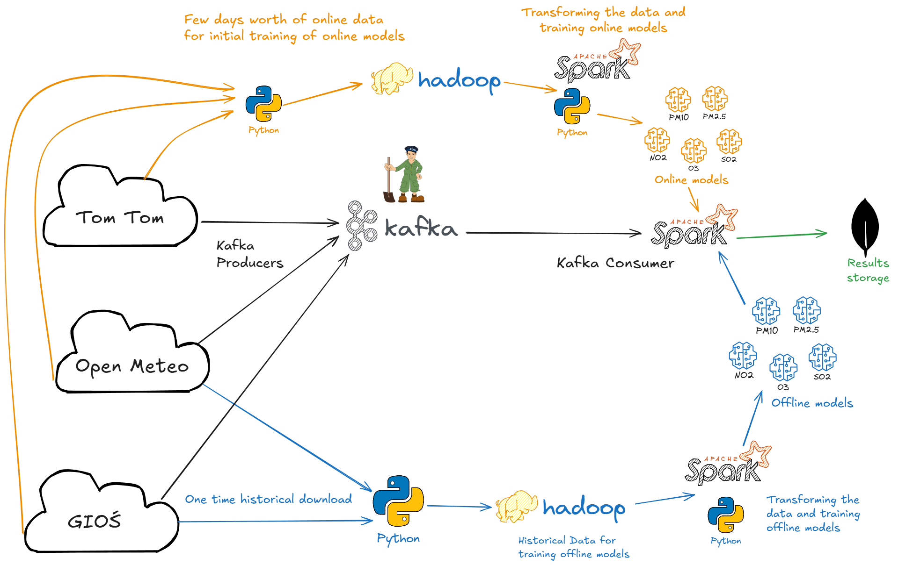

# Big Data approach to Air Quality Prediction in Warsaw
## Introduction
This project focuses on building a Big Data system designed to predict air quality in Warsaw. Given that air pollution poses a significant threat to public health, accurate and timely predictions are crucial for daily life.

## Data Sources
The system integrates information from three distinct domains to provide comprehensive input for predictions:
* Główny Inspektorat Ochrony Środowiska (GIOŚ - Chief Inspectorate for Environmental Protection): This is the primary data source, providing historical and current sensor data from air quality monitoring stations in Warsaw. Specifically, data from the station at Chrościckiego 16/18 was selected due to its comprehensive measurements of all five key pollutants tracked by the Polish Air Quality Index: PM10, PM2.5, O3, NO2, and SO2.
* OpenMeteo: This service supplies historical and current weather conditions, which significantly influence pollution levels. Key meteorological features include temperature, humidity, dew point, rain, snowfall, atmospheric pressure, cloud cover, wind speed, and wind direction.
* TomTom: Provides real-time information on car traffic intensity, specifically the average current speed and "free-flow" speed on selected road segments. This data helps to identify traffic jams, which contribute to vehicle emissions. Due to the lack of free historical data, a small historical dataset was accumulated by regularly collecting current data.

## System Architecture
The project's infrastructure is built upon four Ubuntu 20.04 virtual machines, interconnected within a local network.
* Hadoop: Forms the foundational layer, configured with one Namenode and three Datanodes for distributed storage.
* HDFS (Hadoop Distributed File System): Used for storing data designated for model training, as well as the trained models themselves. Additionally, raw data ingested through the pipeline is also saved to HDFS.
* YARN: Manages resource allocation within the Hadoop ecosystem.
* Kafka: Serves as the central tool for the streaming data pipeline, managed by ZooKeeper. Three dedicated Kafka topics (one for each data source) and three producers are set up to fetch data from the respective APIs.
* Apache Spark: Functions as the Kafka consumer, responsible for processing incoming data streams, transforming them into the required model formats, performing real-time predictions, and then saving the results. Moreover, it plays a crucial role in initial transformation of historical data working in tandem with Python. The latter is also used for data visualisation.
* MongoDB: A NoSQL database used to store the prediction results along with the corresponding input data that led to those predictions.

Full Architecture is presented in the diagram below.  

## Methodology
The project utilizes a two-stage modeling approach: Offline Models for robust foundational predictions and Online Models for real-time adjustments and corrections.
### 1. Data Collection & Preprocessing
* Time Zone Standardization: GIOŚ historical data (UTC+1) and current data (UTC+2) were consistently converted to UTC to ensure data uniformity.
* Data Aggregation: Numerous JSON files collected from GIOŚ and TomTom APIs were joined into unified dataframes. They were also joined with OpenMeteo data.
* Missing Data Imputation & Removal: Single missing hourly data points were interpolated based on adjacent values. However, sequences of multiple missing hours were removed to prevent introducing potentially erroneous dependencies.
* Feature Engineering:
    * Pollutant concentrations were represented by features for the current hour (t), the previous hour (t-1), and the target next hour (t+1).
    * Temporal features such as Hour, Day of Week, Month, and Year were extracted from datetime columns.
    * For TomTom data, a trafficJamRatio feature was computed by dividing currentSpeed by freeFlowSpeed, providing a normalized measure of congestion.
* Data Cleaning:
    * Negative SO2 values found in the offline dataset were removed.
    * For the online dataset, records with pollutant values exceeding the 98th percentile were removed. This was a deliberate choice to enhance model generalization on the limited online data by focusing on typical values rather than extreme outliers.
    * To reduce dimensionality in online models, 11 of 33 trafficJamRatio features were removed if over 90% of their values indicated no congestion (ratio of 1). Snowfall, Month, and Year features were also excluded from online models due to their lack of variability in the short collection period.
### 2. Offline Model Training
* Purpose: These models aim to predict the exact concentration value of each specific pollutant (PM10, PM2.5, NO2, O3, SO2) for the next hour (t+1).
* Algorithm: Random Forest Regressors were selected for their performance in regression tasks.
* Data: Training was conducted on the extensive historical dataset consisting of aggregated GIOŚ and OpenMeteo data.
* Input Features: A comprehensive set of features was used, including current and previous hour's pollutant levels (e.g., pm10, pm10_t-1), all weather features (e.g., temperature, wind_speed), and temporal features (hour, month, year).
* Hyperparameter Tuning & Cross-Validation (Time-Series Approach):
    * To prevent data leakage in time-series data, a specialized cross-validation strategy was employed. The dataset was first chronologically split into 80% for training/validation (train_val) and 20% for final testing.
    * A 3-fold chronological cross-validation was then applied to the train_val set:
        * Fold 1: First 25% of data for training, next 25% for validation.
        * Fold 2: First 50% of data for training, next 25% for validation.
        * Fold 3: First 75% of data for training, next 25% for validation.
    * Features were standardized before each training iteration within the folds.
    * Hyperparameters tested: numTrees (50, 100, 200) and maxDepth (2, 5, 10). The optimal combination was chosen based on the lowest average RMSE.
* Training Variants: Three variants were explored for each pollutant model:
    1. Standard: Model learned and predicted on original (untransformed) pollutant values.
    2. Log-transformed: Pollutant features were logarithmically transformed using log1p to normalize their right-skewed distributions. The model predicted log-transformed values, and results were inverse-transformed (exp1m) for metric calculation.
    3. Hybrid: Log-transformed pollutant input features were used, but the model predicted the original (untransformed) pollutant values.
* Performance: Offline models generally achieved high R2 scores, demonstrating strong predictive capabilities (e.g., 0.94 for O3, 0.93 for PM2.5, 0.87 for PM10, 0.86 for NO2). For most pollutants, the Standard (Variant 1) and Hybrid (Variant 3) models performed comparably, with the Log-transformed variant (Variant 2) typically performing worse, except for SO2, where Variant 2 showed a modest improvement. For simplicity in subsequent online model integration, Variant 1 was chosen for all pollutants.

### 3. Online Model Training
* Purpose: These models are designed to correct the predictions made by the offline models by predicting the residual (the difference between an offline model's prediction and the actual observed pollutant value). The goal is to refine the initial offline predictions.
* Algorithm: Like their offline counterparts, these also use Random Forest Regressors.
* Data: Trained on a smaller, custom-collected dataset of current GIOŚ, OpenMeteo, and TomTom data (collected between May 11-30).
* Input Features: Includes all GIOŚ and OpenMeteo features (current and t-1), combined with the 22 selected trafficJamRatio features.
* Hyperparameter Tuning & Validation:
    * Followed the same time-series cross-validation strategy as offline models.
    * Hyperparameters tested: A wider range including numTrees (20, 50, 100, 200) and maxDepth (1, 2, 3, 5, 10).
    * Crucially, only OpenMeteo and GIOŚ features were standardized; trafficJamRatio features were not standardized as their scale was already appropriate.
* Performance: Online models generally exhibited low R2 values (often negative or slightly above zero), indicating limited standalone predictive power, with the exception of NO2 (R2=0.35). This limitation is largely attributed to the small size of the training dataset. Despite low R2, visual analysis and RMSE comparison on select test subsets indicated that the online correction could improve offline predictions for some pollutants (notably O3 and PM2.5), although results varied depending on the data batch, highlighting the need for more data. Often, very shallow trees (maxDepth=1 or 2) performed best for online models, with deeper trees leading to overfitting due to data scarcity.

## Key Findings & Analysis
* Seasonality of Pollutants:
    * Monthly: PM10, PM2.5, and NO2 concentrations are significantly higher during the heating season (winter months) and lower in summer. O3 concentrations peak in spring and summer due to increased temperature and sunlight.
    * Hourly: NO2 exhibits strong hourly seasonality, peaking during morning and evening rush hours and dropping around midday due to photochemical decomposition. O3 concentrations rise sharply during daylight hours, opposite to NO2, due to photochemical reactions.
* Feature Importance:
    * For offline models, the pollutant concentration from the previous hour (t-1) and the current hour (t) are consistently the most important features.
    * Meteorological variables such as wind speed, temperature, and humidity are also highly significant predictors.
    * Temporal features like month and hour play a crucial role due to observed seasonal and diurnal patterns.
* For online models, trafficJamRatio features occasionally showed importance, but generally contributed less than other features, particularly within the limitations of the small dataset.

## Conclusion & Future Work
The project successfully established a robust Big Data infrastructure and developed a system for air quality prediction in Warsaw. While the offline models demonstrated strong predictive capabilities, the online models, although showing potential for correcting offline predictions, require significantly more data for robust training and validation. The impact of traffic data on pollution prediction is promising but requires larger datasets to be fully confirmed. Further research with expanded online datasets is recommended to solidify the benefits of the two-tiered modeling approach.

## Setup and Usage

### Setup
The aformentioned architecture has to be created as follows:  
1. Create 4 Virtual Machines with Ubuntu 20.04
2. Configure SSH and /etc/hosts
3. JAVA 8 and Hadoop 3.4.1 need to be installed. Any modified configuration files can be found in `conf_files` directory. Those files are:
    * `~/.bashrc`
    * `~/hadoop/etc/hadoop/hadoop-env.sh`
    * ` ~/hadoop/etc/hadoop/core-site.xml`
    * `~/hadoop/etc/hadoop/hdfs-site.xml`
    * `~/hadoop/etc/hadoop/mapred-site.xml`
    * `~/hadoop/etc/hadoop/yarn-site.xml`
    * `~/hadoop/etc/hadoop/workers`
4.  Download and install Apache Spark 3.5.5. Modified files are available in `conf_files` directory.
    * `spark-env.sh`
    * `slaves`
5. Download and install MongoDB. Modified files are available in `conf_files` directory.
    * `mongod.conf`
6. Download and install Kafka 2.8.1. Modified files are availbale in `conf_files` directory.
    * `~/kafka/config/server.properties`
    * `/etc/systemd/system/zookeeper.service`
    * `/etc/systemd/system/kafka.service`

7. After successful configuration of the environment and making sure everything is connected, to start every service (after for example a reboot of VMs) one can use the following commands:
    * `~/hadoop/sbin/start-dfs.sh`
    * `~/hadoop/sbin/start-yarn.sh`
    * `$SPARK_HOME/sbin/start-all.sh`
    * `sudo systemctl start mongod`
    * `sudo systemctl start kafka`

### Usage
This section provides a description of what each of the script was used for:
* Download of historical data (`historical_download` directory):
    * skrypt do pobierania gios
    * skrypt do pobierania tomtom
* Historical data initial transformation (`offline_transformation` directory):
    * `transform_historical_data.py` - PySpark script that loads OpenMeteo and GIOŚ historical data and creates an joined dataframe with all of the data joined by the datetime feature. The dataframe is saved in parquet format.
    * `transform_merged_historical_data_to_model_ready.py` - PySpark script that loads the previous parquet dataframe and creates temporal features as well as lag and lead features for every pollutant. It also handles data inputation and clearing. The dataframe is also saved in parquet format.
* Online data initial transformation (`online_transformation` directory):
    * `transform_online_all.py` - PySpark script that loads OpenMeteo, GIOŚ and TomTom online initial training data (small set of data gathered for initial training of residual models) and merges it into one dataframe. The dataframe is saved in parquet format.
    * `transform_online_merged_to_model_ready.py` - PySpark script that loads the previous online parquet dataframe and creates temporal features as well as lag and lead features for every pollutant. Moreover, it creates _trafficJamRatio_ features for each of the segments. It also handles data inputation and clearing. The dataframe is also saved in parquet format.
    * `add_residua_to_online_frame.py` - PySpark script that loads the previous dataframe, uses trained offline models to predict lag values and then add residua to the frame (this is the target value for online models). It saves the frame in parquet format.
* Training of models (`training` directory) (Note: those scripts were replaced by cross_validation notebooks):
    * `train_offline_model.py` - PySpark script that loads historical offline dataframe, trains, validates the model and saves it. 
    * `train_offline_model_log.py` - PySpark script that loads historical offline dataframe, trains models on log features, validates the model and saves it. 
    * `train_online_model.py` - PySpark script that loads historical online dataframe, trains, validates the model ans saves it.
* Visualisation, Cross Validation, Analysis (`visualisation_and_analysis` directory):
    * `offline_dataset_vis.ipynb` - Provides exploratory analysis of the offline dataset including analysis of distribution, outliers detection, analysis of seasonality, autocorrelation and partial autocorrelation. Also handles feature engineering with log pollutant variables.
    *  `offline_cv.ipynb` - Performs 3-fold time series cross validation on the offline historical dataframe for different hyperparameter configurations for each of the pollutants. Each of them has 3 variants (standard, log and hybrid). Methodology is described in appropriate section. Selects and saves best models for each pollutant.
    * `online_dataset_vis.ipynb` - Provides exploratory analysis of the online dataset including analysis of distribution, outliers detection, analysis of seasonality, autocorrelation and partial autocorrelation. 
    * `online_cv.ipynb` - Performs 3-fold time series cross validation on the online historical dataframe for different hyperparameter configurations for each of the pollutants. Methodology is described in appropriate section. Selects and saves best model for each pollutant.
    * `prediction_vis.ipynb` - Performs exploratory analysis of the results on part of the online training dataset and data stored in MongoDB collected for a day using the pipeline. Compares results achieved by single offline models and a system consisting of offline + online models.
* Kafka Producers for supplying real-time data (`kafka_producers` directory):
    * `gios_kafka_producer.py` - Kafka producer that calls GIOŚ API, collects its data and publishes it to appropriate Kafka topic.
    * `tomtom_kafka_producer.py` - Kafka producer that calls TomTom API, collects its data and publishes it to appropriate Kafka topic.
    * `weather_kafka_producer.py` - Kafka producer that calls OpenMeteo API, collects its data and publishes it to appropriate Kafka topic.
    * `run_producers.sh` - bash script to run all of the producers one by one (suitable for cron scheduling)
    * `points.txt` - points identifying road segments used for calling TomTom API.
* Kafka Consumer (`kafka_consumer` directory):
    * `kafka_consumer.py` - PySpark application that is main part of the pipeline and handles the following:
        * Saves all of the data that appears in the topics to HDFS
        * Waites until there is data in every one of 3 topics.
        * Then it transforms it to one frame suitable for the models.
        * Does prediction using offline models and adds it to the frame.
        * Does prediction using online models and adds it to the frame.
        * Does final predictions (adjusting offline prediction by the online one) and categorizes air quality.
        * Saves the results to MongoDB.

 
## Credits
I've created this project with:
* [Marta Kacperska](https://github.com/fabulousfoxx)
* [Stanisław Horodecki](https://github.com/Grazzly)
* [Igor Podlewski](https://github.com/Igorandor)